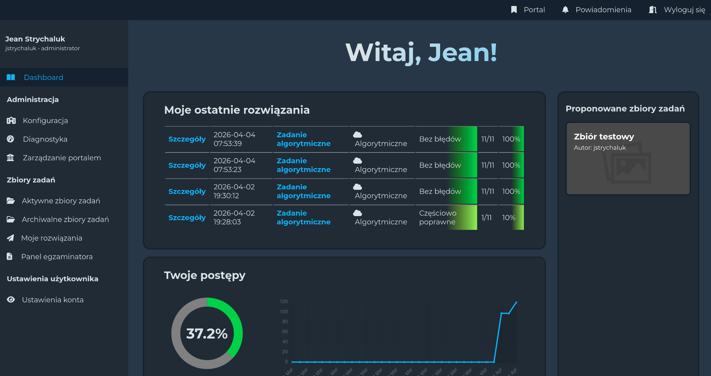
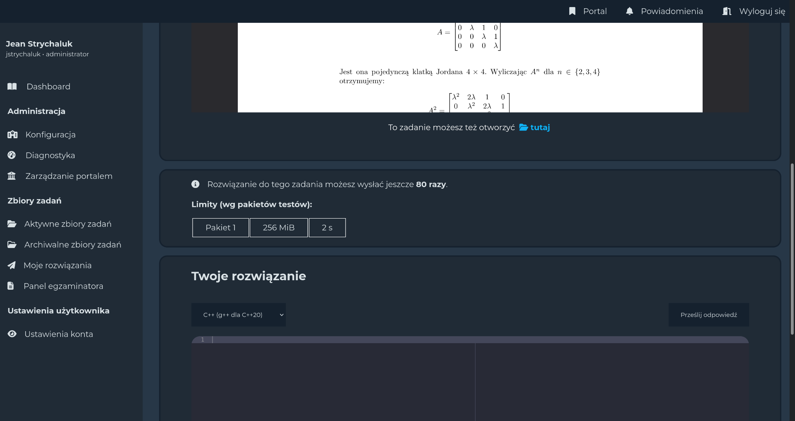

# &nbsp;&nbsp;ESIT

<p align="center">
    
    
    <a href="https://www.codefactor.io/repository/github/jstpp/esit"></a>
</p>

`ESIT` is a simple online judge with additional features. Measure execution time and limit memory inside nsjail-based sandbox environments. Divide your content into sets of exercises and show your results with scoreboards. Extend and personalize platform features with community plugins from GitHub.



## Purpose
ESIT is a platform for organizing contests, exams and other similar forms related to Computer Science.
> [!important]
> Take into consideration, that this is still an unstable project. You are using this software at your own risk. 

## Installation

Create user `esit-user` and download the repository:
```bash
git clone https://github.com/jstpp/esit.git && cd esit
```
You can customize the [config file](include/app/core.php). You should consider this when running it in production, otherwise, you can ignore it.

Start Docker Compose with predefined user-id and group-id:
```bash
UID="<your-uid>" GID="<your-gid>" docker compose -f compose.yaml up
```
> [!tip]
> To check your uid and gid you can use the following commands:
> ```bash
> id -u && id -g
> ```
> 
The service should be available on `localhost:80` unless you change it. The first registered user becomes an admin.

## Technical details
### Evaluation of algorithmic solutions
ESIT uses [nsjail](https://github.com/google/nsjail) to isolate algorithmic solutions and uses default mechanisms of compilers or OS to measure the parameters of compilation. Currently, it supports **Python** (3.11) and **C++** (C++20).



### Evaluation of CTF solutions
ESIT's support for CTF solutions (at the moment) is limited to cases where the flag is hidden inside a single file. Hosting more sophisticated challenges in [nsjail](https://github.com/google/nsjail) is planned in the future.

### Evaluation of other solutions
ESIT also supports:
- writing tasks (with LaTeX support)
- single choice tests
- multiple choice tests

## Custom configuration
Check the ESIT custom configuration options [here](setup/README.md).

> [!tip]
> When running docker installation remember to check if your custom config matches the credentials in [compose.yaml](compose.yaml).

## Translation
Although the code variables and comments are in English, ESIT doesn't provide an English GUI. Feel free to add translations.

## More information
For more information see:
- [worker info](worker/README.md), 
- [plugins](include/app/plugins/README.md), 
- [installation example & custom configuration details](setup/README.md), 
- [MIT license](LICENSE),
- [security annotations](SECURITY.md).
