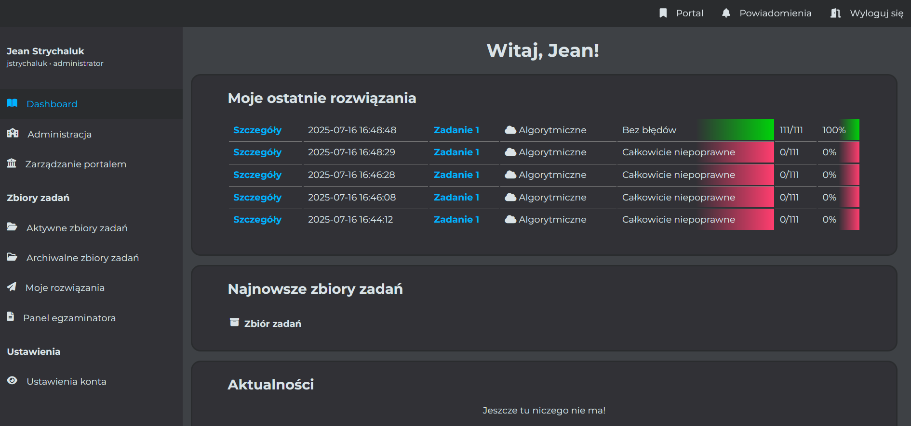
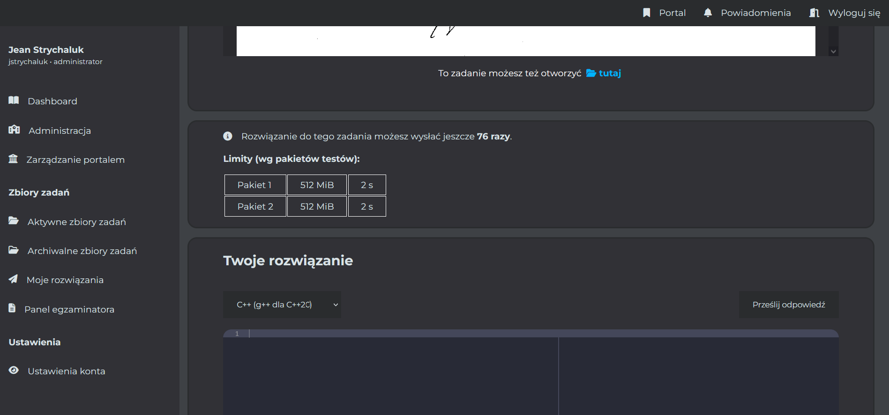

# &nbsp;&nbsp;ESIT
[](https://choosealicense.com/licenses/mit/)

`Evaluation System for IT` - simple online judge with additional features. Measure execution time and limit memory inside nsjail-based sandboxes. Divide your content into sets of exercises and show your results with scoreboards. 


## Purpose
ESIT is a platform for organizing contests, exams and other similar forms related with Computer Science.

> [!important]
> This repo is distributed in the hope that it will be useful, but without any warranty; without even the implied warranty of merchantability or fitness FOR A particular purpose. You are using this software at Your own risk.

## Installation

Create user `esit-user` and download repository:
```bash
git clone https://github.com/jstpp/esit.git && cd esit
```
You can customize your [config file](include/config/config_init.php). You should consider it when You run it in production mode, otherwise You can ignore it.

Start docker compose with predefined user-id and group-id:
```bash
UID="<your-uid>" GID="<your-gid>" docker compose up
```
> [!tip]
> To check your uid and gid you can use the following commands:
> ```bash
> id -u && id -g
> ```
> 
The service should be available on `localhost:80` unless You don't change it. First registered user becomes an admin.

## Technical details
### Evaluation of algorythmic solutions
ESIT uses [nsjail](https://github.com/google/nsjail) to isolate algorythmic solutions and uses default mechanisms of compilers or OS to measure the parameters of compilation. Currently, it supports **python** (3.11) and **C++** (C++20).



### Evaluation of CTF solutions
ESIT's support for CTF solutions (at the moment) is limited to the cases, where the flag is hidden inside single file. Hosting more sophisticated challenges in [nsjail](https://github.com/google/nsjail) is planned in the future.
### Evaluation of other solutions
ESIT also supports:
- writing tasks (with LaTeX support)
- single choice tests
- multiple choice tests

## Config variables
### General config
| Variable | Type | Description |
| --- | --- | --- |
| `$org_link` | string | Your website's URL. **We use it for connection with ESIT workers and for API communication!** |
| `$site_domains` | array | More URLs |
| `$error_link` | string | Your custom error site |
| `$display_debug` | boolean | Displaying debug informations |

> The access to general config variables will be more flexible in the future - the variables would be accessed from GUI instead of config file modifications.
### Database (mariadb) config

| Variable | Type | Description |
| --- | --- | --- |
| `$db_host`| string | Host IP address |
| `$db_username` | string | Your username |
| `$db_password` | string | Your password |
| `$db_database` | string | Name of the database |
| `$db_charset` | string | Charset of the database (`utf8` is default) |

### Broker ([rabbitMQ](https://www.rabbitmq.com/)) config
| Variable | Type | Description |
| --- | --- | --- |
| `$rabbit_mq_host`| string | Host IP address |
| `$rabbit_mq_port` | string | Port for broker |
| `$rabbit_mq_user` | string | Username |
| `$rabbit_mq_password` | string | Password |

### Worker config
| Variable | Type | Description |
| --- | --- | --- |
| `$worker_network_private_key`| string | Key used for API encryption |
| `$worker_trusted_ips` | array | Array of workers' IPs |

> [!tip]
> When running docker installation remember to check if Your custom config matches the credentials in [compose.yaml](compose.yaml).

## Translation
Although the code variables and comments are in English, ESIT doesn't provide English GUI. Feel free to add translations.

## More informations
For more informations see [worker info](worker/README.md), [installation example](setup/README.md), [MIT license](LICENSE) and [security annotations](SECURITY.md).
